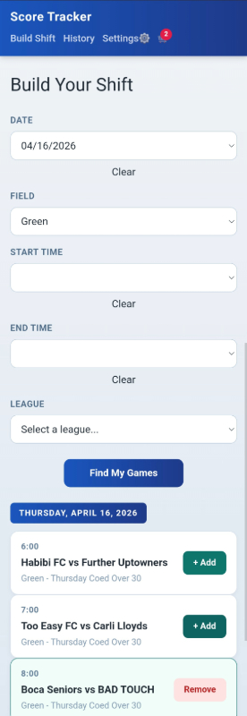

# Referee Score Tracker

> A PWA for soccer referees to import fixtures, track live scores, log match incidents, and email shift reports.

[](https://react.dev)
[](https://www.typescriptlang.org)
[](https://vitejs.dev)
[](https://fastapi.tiangolo.com)
[](https://www.python.org)
[](https://reff-app-vrcj.vercel.app)

**[Live Demo →](https://reff-app-vrcj.vercel.app)**



---

## Features

- **Smart fixture finder** — scrapes Crescent City Soccer league pages and filters games by date, time window, and field
- **Live score tracking** — tap a team card to increment score; per-half timer with overtime indicator
- **Incident logging** — log yellow cards, red cards, and injuries per team with player name and description
- **Shift history** — browse all completed games with full incident records
- **Email shift report** — send a formatted report either through SendGrid (backend API) or your device Mail app
- **PWA-ready (manual install)** — can be installed from Chrome on Android using Add to Home Screen, and works offline for in-progress games via localStorage

---

## Tech Stack

| Layer | Technology |
|---|---|
| Frontend | React 19, TypeScript, Vite |
| Routing | React Router v7 |
| State | React Context + localStorage |
| Backend | FastAPI, Python 3.11, Pydantic v2 |
| Scraping | httpx, BeautifulSoup4 |
| Email | SendGrid API + device Mail app (mailto) |
| Frontend deploy | Vercel |
| Backend deploy | Render |


---

## Local Setup

### Prerequisites

- Node.js ≥ 18
- Python ≥ 3.11
- [uv](https://docs.astral.sh/uv/) (Python package manager)

### 1. Clone the repo

```bash
git clone https://github.com/stharajkiran/Reff_App.git
cd Reff_App
```

### 2. Backend

```bash
cd backend
uv sync                  # installs all Python dependencies
cp .env.example .env     # fill in your keys (see below)
uv run uvicorn app.main:app --reload
```

The API will be available at `http://localhost:8000`.

**Required environment variables** (`backend/.env`):

```
SENDGRID_API_KEY=your_sendgrid_api_key
SENDER_EMAIL=your_verified_sender@example.com
RECIPIENT_EMAIL=where_reports_should_go@example.com
```

### 3. Frontend

```bash
cd frontend
npm install
npm run dev
```

The app will be available at `http://localhost:5173`.

By default the frontend points to `http://localhost:8000` as the API base. For production, set:

```
VITE_API_BASE_URL=https://your-render-backend.onrender.com
```

### 4. Manual PWA Install (Without Plugin)

#### Android

1. Open Chrome and visit the live app URL: `https://reff-app-vrcj.vercel.app/`
2. Tap the three-dot menu in Chrome
3. Tap **Add to Home screen**
4. Confirm the install prompt

After install, the app opens from your home screen with the app name and icon, behaving like a native app window.

---

## API Documentation

FastAPI generates interactive docs automatically at `http://localhost:8000/docs`.

### `GET /api/leagues`

Returns the list of available leagues.

**Response**
```json
[
  {"id": "friday-over-40", "name": "Friday Over 40"},
  {"id": "saturday-division-3", "name": "Saturday Division 3"}
]

```

---

### `GET /api/fixtures?leagueId={id}`

Scrapes upcoming fixtures for a given league.

**Query params**

| Param | Type | Required | Description |
|---|---|---|---|
| `leagueId` | string | ✅ | League ID from `/api/leagues` |

**Response** — array of fixture objects:
```json
[
    {
    "id": "2026-april-17-motagua-swamp-chickens",
    "date": "2026-april-17",
    "time": "6:00pm",
    "home": "Motagua",
    "away": "Swamp Chickens",
    "location": "Green",
    "leagueName": "Friday Over 40",
    "needsFieldReview": false
    }
]
```


### `POST /api/report`

Sends a formatted shift report email via SendGrid.

**Request body** — a `CompletedShift` object:
```json
{
  "id": "shift-uuid",
  "date": "2026-april-18",
  "completedAt": "2026-04-18T22:00:00",
  "reportSent": false,
  "games": [
    {
      "id": "abc123",
      "date": "2026-april-18",
      "time": "6:00pm",
      "home": "Team A",
      "away": "Team B",
      "location": "Green Field 1",
      "leagueName": "Men's Open",
      "needsFieldReview": false,
      "status": "final",
      "homeScore": 2,
      "awayScore": 1,
      "incidents": [
        {
          "id": "inc-uuid",
          "type": "yellow_card",
          "team": "Team A",
          "name": "John Doe",
          "description": "Foul tackle"
        }
      ]
    }
  ]
}
```

**Response**
```json
{ "success": true }
```
